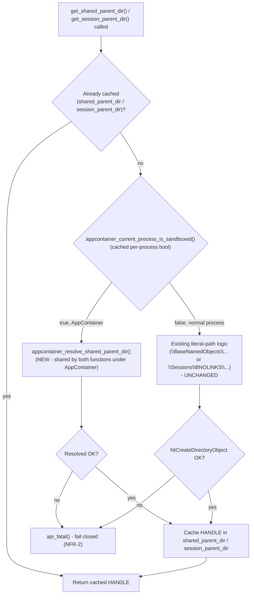

# Business Logic Model — Unit 1b (AppContainer Patch)

**Note**: No clarifying questions were needed for this stage (see question-scope memory) — the fix approach was already settled in Application Design (`GetAppContainerNamedObjectPath`, per that stage's Question 5), and the remaining details below are implementation-mechanism decisions within the already-approved NFR-1 (isolation preserved) / NFR-2 (fail closed) constraints.

## Patched Control Flow — `get_shared_parent_dir()` / `get_session_parent_dir()`

## Key Design Decision: Unify `get_shared_parent_dir()` and `get_session_parent_dir()` Under AppContainer
`GetAppContainerNamedObjectPath` already returns a path that is inherently scoped to both the current session AND the specific AppContainer (its Windows documentation describes the returned path as under `\Sessions\<n>\AppContainerNamedObjects\<AppContainerSid>`). This means the session-vs-global distinction that matters for the *existing* literal-path logic (querying `NtQueryInformationProcess(ProcessSessionInformation)` to choose between `\BaseNamedObjects\...` and `\Sessions\BNOLINKS\<n>\...`) has no equivalent need under AppContainer — there is exactly one correct namespace root per AppContainer profile per session, and `GetAppContainerNamedObjectPath` already computes it.

**Decision**: when `appcontainer_current_process_is_sandboxed()` is true, **both** `get_shared_parent_dir()` and `get_session_parent_dir()` call the same new `appcontainer_resolve_shared_parent_dir()` function and get equivalent (in practice, identical) results — no separate "AppContainer session" resolver is needed. This is simpler than mirroring the existing dual-path structure and is correct because the object-naming suffix (below) still gives per-installation uniqueness within that shared root.

## AppContainer Namespace Resolution Algorithm (`appcontainer_resolve_shared_parent_dir()`)
1. Obtain the current process token (via existing/adjacent `OpenProcessToken` usage patterns in `advapi32.cc`).
2. Call `GetAppContainerNamedObjectPath(token, NULL /* AppContainerSid - NULL uses the token's own */, desiredAccess, FALSE /* relative */, &objectPathBuffer)` to obtain the AppContainer's private namespace root path.
3. Construct the full directory-object name by concatenating that root path with the **same suffix construction already used today** for the global path: `%s%s-%S` formatted from `cygwin_version.shared_id`, the relevant version component, and `cygheap->installation_key` (unchanged from the existing `get_shared_parent_dir()` logic — see `code-structure.md`'s "Cached singleton handle" pattern reference).
4. Call `NtCreateDirectoryObject` with `OBJ_OPENIF` on that combined path, using the **same** `everyone_sd(CYG_SHARED_DIR_ACCESS)` security descriptor already used today.
5. On success, return the handle (caller caches it exactly as today). On failure, propagate the failure up so the existing `api_fatal()` fail-closed behavior triggers unchanged.

## Why Reuse the Existing Suffix and DACL
- **Suffix reuse**: keeps object naming consistent with every other place in the codebase that reasons about "the shared object for this installation" (per `component-dependency.md`'s confirmation that all downstream consumers depend only on the returned *handle*, not the path string itself) — and ensures multiple different Cygwin/MSYS installations running inside the *same* AppContainer profile still get distinct, non-colliding namespaces.
- **DACL reuse**: the object's location (inside the AppContainer's own private namespace segment) is what provides the actual isolation boundary now — access to that segment is already restricted by Windows to processes holding that AppContainer's token. Reusing the existing permissive-within-that-scope `everyone_sd()` avoids introducing a second, differently-behaved ACL model to reason about, and keeps behavior consistent with the non-AppContainer path (which also already relies on the namespace location, not a restrictive DACL, as its real security boundary).

## AppContainer Capability Detection (`appcontainer_current_process_is_sandboxed()`)
1. On first call, open the current process token and call `GetTokenInformation(..., TokenIsAppContainer, ...)`.
2. Cache the boolean result in a file-scope `static NO_COPY` variable (mirrors the existing `shared_parent_dir` caching pattern in `mm/shared.cc`), so subsequent calls (including from `get_session_parent_dir()`) are free.
3. This check has no dependency on `cygheap` (unlike the resolution step, which needs `installation_key`) — it can safely run at the very top of `memory_init()`'s call chain, before `cygheap` initialization is guaranteed complete, if that ordering matters (to be confirmed against actual `dcrt0.cc` sequencing during Code Generation).
