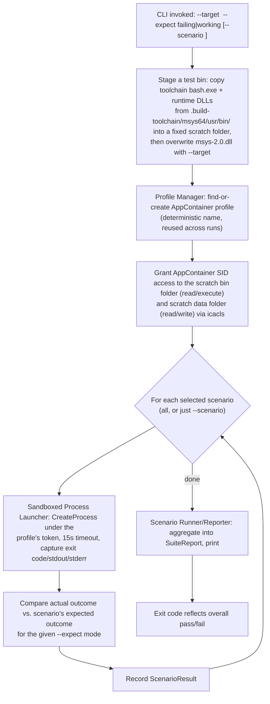

# Business Logic Model — Unit 2 (AppContainer Test Harness)

## End-to-End Workflow (Suite Run)

## Test Bin Staging (resolves: "how do we test a specific msys-2.0.dll?")
`bash.exe` loads `msys-2.0.dll` from its own directory at runtime. To test a specific DLL (vanilla or patched) without ever mutating the shared `.build-toolchain/` install in place (which would be racy for repeated/automated runs and risks leaving the shared toolchain broken), each run:
1. Copies `bash.exe` and its runtime DLL dependencies from `.build-toolchain/msys64/usr/bin/` into a **fixed** scratch folder: `E:\Temp\appcontainer-harness\bin\` (overwritten fresh each run, not accumulated as timestamped run folders — keeps disk usage flat).
2. Overwrites `msys-2.0.dll` in that copy with the file at the `--target` path.
3. This staged copy — never the shared toolchain — is what's actually launched under the AppContainer token.

A second fixed scratch folder, `E:\Temp\appcontainer-harness\data\`, is used as the writable working directory for the file-I/O smoke scenario.

## AppContainer Profile & Access Grants
- **Profile**: one deterministically-named profile (e.g. `AIDLC.AppContainerHarness`) is found-or-created at the start of a run and reused across every scenario in that run (per Question 5) — this also lets the "multiple processes share state under one profile" requirement actually be exercised, since every scenario launch in a run uses the same profile/token.
- **Capabilities**: none requested (empty `SECURITY_CAPABILITIES` list) — this test doesn't need network/device capabilities; the scratch-folder access below is granted via direct ACL on the AppContainer SID, which is the correct mechanism for arbitrary non-package-folder access (capabilities don't cover this).
- **ACL grants** (via `icacls`, done once per run after profile creation): the AppContainer SID gets read+execute on `E:\Temp\appcontainer-harness\bin\`, and read+write on `E:\Temp\appcontainer-harness\data\`.
- **Profile persistence**: profiles are **not** deleted automatically after a run (avoids SID churn/orphaned-profile buildup across repeated runs during iterative Phase 2/3/4 work). A `--cleanup` CLI flag exists to explicitly delete the profile when the engagement is done.

## Scenario Execution
- **Selection**: `--scenario <name>` runs one named scenario; omitting it runs the full Scenario Library.
- **Mode**: `--expect failing|working` tells the comparison logic which expected outcome to check each scenario's result against (see `domain-entities.md`/`business-rules.md`).
- **Isolation between scenarios in a run**: each scenario is a fresh `CreateProcess` launch (fresh process every time) under the *same* reused profile/token — process-level isolation, profile-level sharing.
- **Continue-on-failure**: a scenario failing does not abort the run — all selected scenarios run, and the final report shows every result, so a single run gives a complete picture rather than stopping at the first failure.
