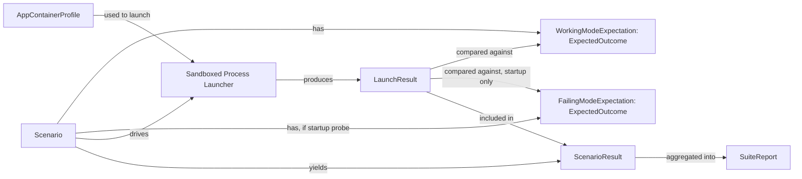

# Domain Entities — Unit 2 (AppContainer Test Harness)

## AppContainerProfile
- `Name: string` — fixed, deterministic (e.g. `AIDLC.AppContainerHarness`)
- `Sid: SecurityIdentifier` — resolved on creation/lookup
- `Capabilities: Capability[]` — empty for this harness (see `business-logic-model.md`)

## LaunchResult
- `ExitCode: int?` — null if the process never produced one (e.g. killed on timeout)
- `Stdout: string`
- `Stderr: string`
- `TimedOut: bool`
- `Duration: TimeSpan`

## ExpectedOutcome
- `ExpectedExitCode: int?` — e.g. `0` for working mode; null/not-applicable for the failing-mode startup probe (the process may not produce a normal exit code at all)
- `RequiredOutputPatterns: string[]` — substrings/regexes that must appear somewhere in stdout+stderr (e.g. `["NtCreateDirectoryObject", "0xC0000022"]` for the startup-failure signature; `["hello-from-scenario"]` for a working-mode echo scenario)
- `RequireCleanExit: bool` — whether a nonzero/absent exit code alone is disqualifying, independent of pattern matches

## Scenario
- `Name: string` — e.g. `startup`, `echo`, `control-flow-script`, `fork-subshell`, `file-io`, `env-vars`, `pipes`
- `Description: string`
- `Command: string` — the command/script passed to the staged `bash.exe`
- `IsStartupProbe: bool` — true only for `startup` (governs BR-1's failing-mode scoping)
- `WorkingModeExpectation: ExpectedOutcome`
- `FailingModeExpectation: ExpectedOutcome?` — non-null only for `startup` (per BR-1)

## ScenarioResult
- `Scenario: Scenario`
- `Mode: "failing" | "working"`
- `Actual: LaunchResult`
- `Passed: bool`
- `FailureReason: string?` — e.g. `"timeout"`, `"exit code mismatch: expected 0, got 1"`, `"missing required pattern: hello-from-scenario"`, `"not applicable in failing mode"` (see BR-1)

## SuiteReport
- `RunTimestamp: DateTime`
- `TargetDllPath: string`
- `Mode: "failing" | "working"`
- `Results: ScenarioResult[]`
- `OverallPassed: bool` — per BR-5

## Relationships

