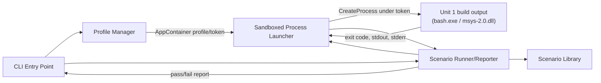

# Component Dependency

## Dependency Matrix

| Component | Depends On | Type |
|---|---|---|
| Shared Parent Directory Provider (`mm/shared.cc`) | AppContainer Capability Detector | Compile/Runtime |
| Shared Parent Directory Provider (`mm/shared.cc`) | AppContainer Namespace Resolver | Compile/Runtime |
| AppContainer Capability Detector (`appcontainer.cc`) | `advapi32.cc` token wrapper | Compile/Runtime |
| AppContainer Namespace Resolver (`appcontainer.cc`) | `GetAppContainerNamedObjectPath` (Win32/`securityappcontainer.h`), possibly via `autoload.cc` | Compile/Runtime |
| AppContainer Capability Detector / Namespace Resolver | `wincap.cc` "OS supports AppContainer" flag | Runtime (gate) |
| `dcrt0.cc` (`memory_init()`) | Shared Parent Directory Provider | Runtime (unchanged existing dependency) |
| Downstream named-object consumers (`kernel32.cc`, `pinfo.cc`, `flock.cc`, `fhandler/{fifo,mqueue,socket_unix}.cc`) | Shared Parent Directory Provider | Runtime (unchanged existing dependency — transparent to the AppContainer change) |
| CLI Entry Point (harness) | Profile Manager, Sandboxed Process Launcher, Scenario Runner/Reporter | Compile/Runtime |
| Scenario Runner/Reporter | Scenario Library, Sandboxed Process Launcher | Compile/Runtime |
| Sandboxed Process Launcher | Profile Manager (for the AppContainer token/SID to launch under) | Runtime |

## Cross-Unit Relationship
- **Unit 1 (winsup/cygwin) and Unit 2 (test harness) have no compile-time or link-time dependency on each other.**
- **Runtime-only relationship**: Unit 2 (harness) launches Unit 1's build output (`bash.exe`/`msys-2.0.dll`) as an external target process. The only "contract" between them is: given a path to an executable, the harness can launch it under an AppContainer token and observe its exit code/stdout/stderr. No shared code, headers, or IPC protocol.
- **Sequencing**: Unit 1's vanilla build must exist before Unit 2's Validation Workflow can run its first real test (FR-2); after that, both units can iterate independently until the final validation pass (FR-3/FR-4) needs the patched Unit 1 build again.

## Communication Patterns
- **Within Unit 1**: Direct in-process function calls only (native code, single DLL) — no IPC, no message passing. The Shared Parent Directory Provider calls into the new AppContainer Capability Detector/Namespace Resolver synchronously during startup.
- **Within Unit 2**: Direct in-process method calls (single C# executable/library) — Profile Manager, Launcher, Scenario Runner, and CLI are all in the same process.
- **Between Unit 1 and Unit 2**: OS-level process creation and standard I/O capture only (`CreateProcess`, exit code, stdout/stderr redirection) — no custom protocol.

## Data Flow (Validation Workflow)

