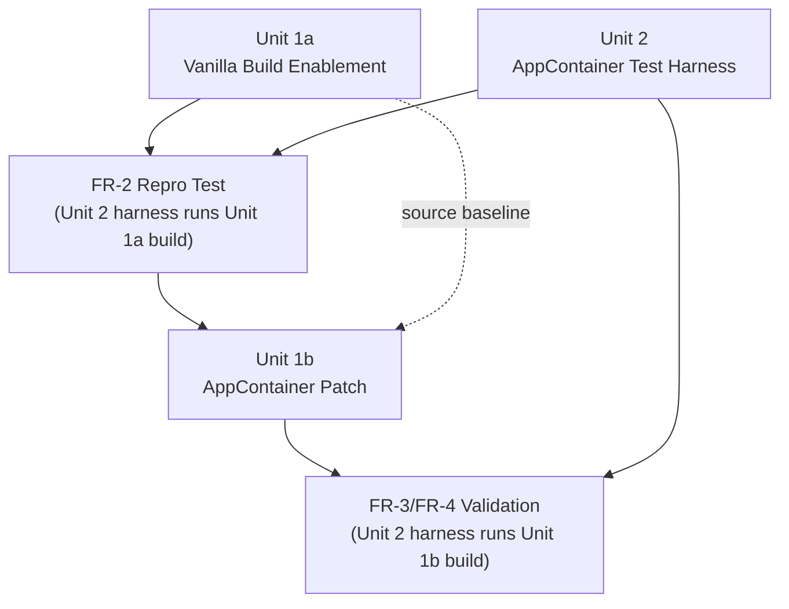

# Unit of Work Dependency

## Dependency Matrix

| Unit | Depends On | Dependency Type | Reason |
|---|---|---|---|
| Unit 1a (vanilla build) | — (none) | — | First unit in the sequence; only depends on the external MSYS2 toolchain (not another unit) |
| Unit 1b (AppContainer patch) | Unit 1a | Build-time (source baseline) | Patches are written against and rebuilt from Unit 1a's working vanilla checkout/build |
| Unit 2 (test harness) | — (none, compile-time) | — | No shared code/headers with Unit 1a or 1b (per `component-dependency.md`) |
| Unit 2 (test harness) | Unit 1a | Runtime (test target) | FR-2's independent repro requires launching Unit 1a's vanilla build under the harness |
| Unit 2 (test harness) | Unit 1b | Runtime (test target) | FR-3/FR-4 validation and NFR-6 smoke tests require launching Unit 1b's patched build under the harness |

## Update/Build Sequence

- **Update Approach**: Hybrid (unchanged from `execution-plan.md`) — Unit 1a and Unit 2 can be developed in parallel; they only need to meet at the FR-2 repro-test checkpoint. Unit 1b starts only after that checkpoint confirms both are working correctly (a faithful vanilla build, a harness that correctly reproduces the known failure).
- **Critical Path**: Unit 1a → FR-2 repro checkpoint → Unit 1b → FR-3/FR-4 validation. Unit 1a's build feasibility remains the highest-risk gate in the whole sequence.
- **Coordination Points**: The only coordination point between Unit 2 and Units 1a/1b is the target executable path passed as a runtime argument — no shared code, headers, or build artifacts beyond that.
- **Testing Checkpoints**: (1) Unit 1a passes an unsandboxed smoke check before being trusted as a repro baseline; (2) Unit 2 correctly reproduces the documented failure against Unit 1a before Unit 1b's patch is considered validated by it; (3) Unit 1b's patched build passes the harness's smoke-test scenarios (NFR-6) before the engagement is considered done.
- **Rollback Strategy**: Each unit's changes are independently revertible via git. Unit 1a has no source changes to roll back (build config only). Unit 1b's patch is a small, additive diff to `winsup/cygwin` — a standard `git revert` restores prior behavior. Unit 2 is entirely new, additive code under `tools/appcontainer-harness/` with no impact on existing code if removed.
