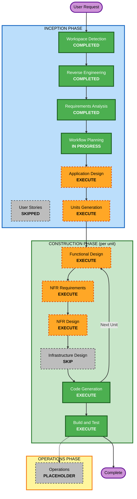

# Execution Plan

## Detailed Analysis Summary

### Transformation Scope (Brownfield)
- **Transformation Type**: Single-component targeted patch (not an architectural transformation) — localized to `winsup/cygwin`'s process-startup/shared-memory subsystem, plus one new standalone test-harness component built from scratch.
- **Primary Changes**: Add AppContainer-token detection and AppContainer-scoped namespace-path resolution to `get_shared_parent_dir()` and `get_session_parent_dir()` in `winsup/cygwin/mm/shared.cc`; extend `wincap.cc` (capability flag) and `advapi32.cc`/`autoload.cc` (new token/native-API wrappers) to support it.
- **Related Components**: A new, independent C# AppContainer test harness (no dependency on `winsup/cygwin` source) used to reproduce the failure (Phase 2) and validate the fix (Phase 3/4).

### Change Impact Assessment
- **User-facing changes**: No (this build is used programmatically/interactively by the requesting user only, not distributed to end users)
- **Structural changes**: No — no architectural refactor, two existing functions gain a new conditional branch
- **Data model changes**: No new persistent data models; a small amount of new runtime state (cached "is AppContainer" flag) is added, following the existing `shared_parent_dir`/`session_parent_dir` static-cache pattern
- **API changes**: No public POSIX-facing API changes; internal-only functions are modified
- **NFR impact**: Yes — security (isolation must be preserved, fail-closed on error), platform-target (Windows 10/11), and supply-chain (isolated/trusted toolchain install) NFRs all apply, per `requirements.md`

### Component Relationships
- **Primary Component**: `winsup/cygwin` (specifically `mm/shared.cc`, `wincap.cc`, `advapi32.cc`, `autoload.cc`/`local_includes/ntdll.h`)
- **New Component**: AppContainer test harness (C#, standalone, new)
- **Dependent Components**: All downstream named-object consumers in `winsup/cygwin` (`kernel32.cc`, `pinfo.cc`, `flock.cc`, `fhandler/{fifo,mqueue,socket_unix}.cc`) — unchanged directly, but depend on the patched functions' cached handle continuing to behave correctly
- **Supporting Components**: `winsup/testsuite` referenced only as a style precedent for smoke tests; not extended with new DejaGNU cases (Phase 4/NFR-6 uses ad hoc smoke scripts run under the harness instead, since AppContainer scenarios aren't part of the existing suite)

| Component | Change Type | Change Reason | Change Priority |
|---|---|---|---|
| `winsup/cygwin` (build config only) | Configuration-only | Establish isolated, working build (FR-1) | Critical (blocks everything else) |
| AppContainer test harness (new) | Major (new) | Independent failure repro + fix validation (FR-2, FR-4) | Critical (blocks patch validation) |
| `mm/shared.cc` | Minor (additive branch, no removed behavior) | Core fix (FR-3) | Critical |
| `wincap.cc`, `advapi32.cc`, `autoload.cc` | Minor (additive) | Supporting capability/API detection for the fix | Important |

### Risk Assessment
- **Risk Level**: High — kernel-native-API-level Windows security-context work; Phase 1 (self-hosted MSYS2 build) is an explicitly flagged unknown; Phase 4 may surface additional AppContainer namespace walls beyond the known one
- **Rollback Complexity**: Easy — the fix is a small, additive source diff in version control; reverting is a standard git revert
- **Testing Complexity**: Complex — no existing AppContainer test infrastructure exists anywhere in the repo or its test suite; a new harness must be built and trusted before it can validate anything

## Workflow Visualization



### Text Alternative
```
INCEPTION PHASE
- Workspace Detection: COMPLETED
- Reverse Engineering: COMPLETED
- Requirements Analysis: COMPLETED
- User Stories: SKIPPED (no distinct user personas/workflows for this technical bug-fix)
- Workflow Planning: IN PROGRESS (this document)
- Application Design: EXECUTE (new functions/harness component need definition)
- Units Generation: EXECUTE (splits work into 2 units: winsup/cygwin patch, AppContainer test harness)

CONSTRUCTION PHASE (runs once per unit, in dependency order)
- Functional Design: EXECUTE (new AppContainer-detection/namespace logic + harness workflow need design)
- NFR Requirements: EXECUTE (tech stack choices: portable MSYS2 layout, .NET target, plus security NFR concretization)
- NFR Design: EXECUTE (fail-closed pattern, capability-flag pattern, autoload pattern for new API)
- Infrastructure Design: SKIP (no cloud/deployment infrastructure involved)
- Code Generation: EXECUTE (always)
- Build and Test: EXECUTE (always)

OPERATIONS PHASE
- Operations: PLACEHOLDER (not applicable - no deployment target)
```

## Phases to Execute

### INCEPTION PHASE
- [x] Workspace Detection (COMPLETED)
- [x] Reverse Engineering (COMPLETED)
- [x] Requirements Analysis (COMPLETED)
- [x] User Stories (SKIPPED)
  - **Rationale**: Pure technical bug-fix/capability engagement with a single requester, no distinct user personas, workflows, or acceptance-criteria ambiguity that stories would clarify beyond what `requirements.md` already captures.
- [x] Execution Plan (IN PROGRESS - this document)
- [ ] Application Design - **EXECUTE**
  - **Rationale**: New internal functions need their responsibilities/signatures defined (AppContainer detection, namespace-path resolution), and a wholly new component (the C# test harness) needs its responsibilities and interface to the built binaries defined before code generation.
- [ ] Units Generation - **EXECUTE**
  - **Rationale**: The work naturally decomposes into two units with entirely different toolchains (C/autotools vs C#/.NET) and different Phase alignment (build+patch vs test harness) — splitting them clarifies dependency order and lets Construction-phase stages be scoped per unit.

### CONSTRUCTION PHASE (per unit, once units are defined)
- [ ] Functional Design - **EXECUTE**
  - **Rationale**: AppContainer detection → namespace-path resolution → fail-closed fallback is genuinely new decision logic requiring design, not a trivial edit; the test harness's create-profile → launch → capture → compare workflow also needs design.
- [ ] NFR Requirements - **EXECUTE**
  - **Rationale**: Tech-stack decisions remain open (portable MSYS2 layout mechanics, .NET target framework/version for the harness, how smoke tests are scripted) and the Security Baseline NFRs from `requirements.md` need to be concretized into design patterns.
- [ ] NFR Design - **EXECUTE**
  - **Rationale**: Follows from NFR Requirements executing; incorporates the fail-closed and capability-flag patterns into the actual design.
- [ ] Infrastructure Design - **SKIP**
  - **Rationale**: No cloud/deployment infrastructure, networking, or IaC involved — this is a local native build and a local test harness.
- [ ] Code Generation - **EXECUTE (ALWAYS)**
  - **Rationale**: Implementation planning and code generation needed for both units.
- [ ] Build and Test - **EXECUTE (ALWAYS)**
  - **Rationale**: Build, test, and verification needed — this is also where FR-1 (vanilla build) and the smoke-test pass (NFR-6) are executed.

### OPERATIONS PHASE
- [ ] Operations - **PLACEHOLDER**
  - **Rationale**: Not applicable — no deployment/monitoring target for a locally-built runtime patch.

## Package Change Sequence (Brownfield)

- **Update Approach**: Hybrid — the AppContainer test harness (Unit 2) has no dependency on `winsup/cygwin` source and can be designed/built in parallel with the `winsup/cygwin` vanilla build (Unit 1, FR-1). However, FR-2 (independent repro) requires both to be complete before it can run, and FR-3/FR-4 require the patched Unit 1 plus the already-validated Unit 2 harness.
- **Critical Path**: Unit 1 (`winsup/cygwin`) blocks final validation of everything, since FR-1's build feasibility is the single biggest flagged unknown in the whole engagement.
- **Coordination Points**: The harness's only contract with Unit 1 is "launch this .exe/.dll under a given AppContainer profile and observe exit behavior" — no shared code or API contract beyond process launch, so coordination risk is low.
- **Testing Checkpoints**: (1) vanilla build runs normally unsandboxed → (2) harness reproduces the known failure against the vanilla build → (3) patched build no longer fails the same way under the harness → (4) smoke-test scenarios pass under the harness.

1. **winsup/cygwin — vanilla build (FR-1)** — Must-update-first; blocks all subsequent validation.
2. **AppContainer test harness (FR-2)** — Can proceed in parallel with (1); needs (1)'s output only at the point of running the actual repro test.
3. **winsup/cygwin — patch (FR-3)** — Depends on both (1) and (2) being validated (vanilla build confirmed working, harness confirmed faithfully reproducing the failure).
4. **Further-wall investigation (FR-4)** — Depends on (3); reuses the harness from (2).

## Estimated Timeline
- **Total Stages to Execute**: 8 (Application Design, Units Generation, then per-unit: Functional Design, NFR Requirements, NFR Design, Code Generation, Build and Test — Infrastructure Design skipped)
- **Estimated Duration**: Not time-boxed — this is agent-driven, iterative engineering work gated by build/test feedback (especially Phase 1's build feasibility and Phase 4's open-ended "check for more walls"), not a calendar estimate.

## Success Criteria
- **Primary Goal**: `bash.exe`/`msys-2.0.dll` starts and runs common usage scenarios successfully under a Windows AppContainer (LowBox) token, without weakening AppContainer security isolation.
- **Key Deliverables**: Source patch/diff to `winsup/cygwin`; the new C# AppContainer test harness; a per-phase findings report; built and tested `msys-2.0.dll` (and `bash.exe` if feasible) binaries.
- **Quality Gates**: Vanilla build passes normal (unsandboxed) smoke tests before patching (FR-1) → harness independently reproduces the documented failure before the fix is trusted as validated (FR-2) → patched build no longer hits the reported failure under the harness (FR-3) → smoke-test scenarios (NFR-6) pass under the harness, and any newly discovered walls are documented rather than silently left unresolved (FR-4).
- **Integration Testing**: Harness-driven end-to-end runs (launch → startup → basic command execution) stand in for integration testing, since there's no multi-service integration surface in this engagement.
