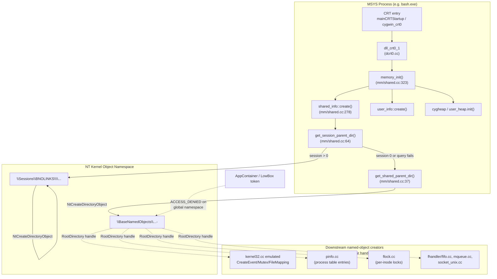
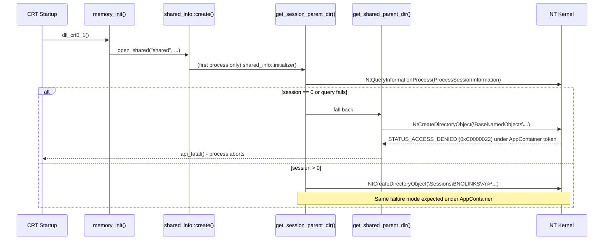

# System Architecture

## System Overview
`winsup/cygwin` compiles to `msys-2.0.dll`, a POSIX-emulation runtime loaded by every MSYS-linked Windows binary (notably `bash.exe` in Git for Windows). On process start, fork, and exec, the DLL initializes process-wide and installation-wide shared state by creating/opening a chain of named NT kernel objects rooted at a **shared parent directory object** in the Windows object-manager namespace (normally `\BaseNamedObjects\...` or, when a Terminal Services session is active, `\Sessions\BNOLINKS\<n>\...`). This works today under normal (unrestricted) tokens. Under a Windows AppContainer (LowBox) token, the global `\BaseNamedObjects` namespace is unreachable by design, so the very first attempt to create that root directory object fails and the process aborts before running any user code. Analysis is scoped to `winsup/cygwin`; `winsup/cygserver`, `newlib`, and `libgloss` are out of scope (see business-overview.md).

## Architecture Diagram

## Component Descriptions

### mm/shared.cc — shared-object namespace root
- **Purpose**: Owns creation/caching of the process's root handle(s) into the NT object-manager namespace that all other named kernel objects are created relative to.
- **Responsibilities**: `get_shared_parent_dir()` (global `\BaseNamedObjects` root, cached in static `shared_parent_dir`), `get_session_parent_dir()` (session-scoped `\Sessions\BNOLINKS\<n>` root, cached in static `session_parent_dir`), `shared_info::create()`/`initialize()` (global shared-memory-backed system state).
- **Dependencies**: `ntdll.h` (`NtCreateDirectoryObject`), `cygheap` (installation key), `everyone_sd()` (security descriptor for the directory object).
- **Type**: Application (runtime core) — **primary patch target**.

### dcrt0.cc — CRT/DLL startup sequencing
- **Purpose**: Implements the C runtime / DLL entry sequence for every MSYS process.
- **Responsibilities**: `dll_crt0_1` (first-time process init, calls `memory_init()`), `child_info_fork::handle_fork()` and `child_info_spawn::handle_spawn()` (re-enter `memory_init()` on every fork/exec).
- **Dependencies**: `mm/shared.cc`, `cygheap`, `pinfo`.
- **Type**: Application (runtime core).

### dll_init.cc / init.cc — DLL attach glue
- **Purpose**: Lower-level DLL attach/detach and asm-level init glue invoked before `dcrt0.cc` logic runs.
- **Type**: Application (runtime core).

### pinfo.cc, kernel32.cc, flock.cc, fhandler/fifo.cc, fhandler/mqueue.cc, fhandler/socket_unix.cc — downstream named-object consumers
- **Purpose**: Create process-table entries, emulated Win32 sync objects, file locks, and named pipes/queues/sockets as NT objects **relative to** the handle returned by `get_shared_parent_dir()`/`get_session_parent_dir()`.
- **Responsibilities**: None of these construct an independent absolute `\BaseNamedObjects\...` path themselves — confirmed by codebase search; they all pass the cached parent-directory handle as `RootDirectory` in `InitializeObjectAttributes()`. This means the object-namespace problem is structurally contained to the two functions in `mm/shared.cc`.
- **Type**: Application (runtime core), downstream of the patch target.

### wincap.cc — OS capability table
- **Purpose**: Central table of OS-version/feature capability flags consulted throughout the runtime.
- **Responsibilities**: Natural location to add an "is this process running under an AppContainer token" capability flag that `mm/shared.cc` can branch on.
- **Type**: Application (runtime core), extension point for the fix.

### advapi32.cc — token/SID API wrappers
- **Purpose**: Wraps `advapi32.dll` security/token APIs.
- **Responsibilities**: Currently does **not** call `GetTokenInformation` anywhere (confirmed via search) — will need a new wrapper for `TokenIsAppContainer`/`TokenAppContainerSid` detection.
- **Type**: Application (runtime core), extension point for the fix.

### autoload.cc / ntdll.h — lazy native-API import table
- **Purpose**: Declares and lazily binds `ntdll.dll` native APIs (no static import lib; resolved at runtime).
- **Responsibilities**: Would need a new autoload declaration for `GetAppContainerNamedObjectPath` (from `securityappcontainer.h`) if that becomes the chosen fix mechanism.
- **Type**: Infrastructure/glue, extension point for the fix.

## Data Flow

## Integration Points
- **Native NT APIs**: `NtCreateDirectoryObject`, `NtOpenDirectoryObject`, `NtQueryInformationProcess` (`ntdll.dll`, lazily bound via `autoload.cc`).
- **Win32 security APIs**: `advapi32.dll` token/SID APIs (not yet used for AppContainer detection — gap to fill).
- **No external network/database integration** — this subsystem is purely local OS-kernel-object interaction.

## Infrastructure Components
- Not applicable — this is a native Windows DLL/runtime, not a deployed service. No CDK/Terraform/cloud infrastructure involved.
