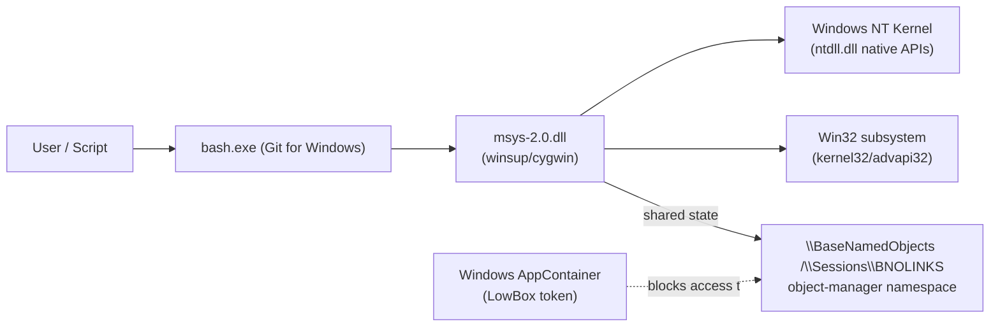

# Business Overview

**Scope note**: This is a systems-software repository (a POSIX-emulation runtime), not a business application. "Business Transactions" below are read as *core operational scenarios* the runtime must support, and "Business Description" as the system's purpose. Analysis is scoped to `winsup/cygwin`, per `aidlc-docs/aidlc-state.md`.

## System Context Diagram

## Business Description
- **Purpose**: `winsup/cygwin` builds `msys-2.0.dll`, the POSIX-emulation runtime that gives Windows-native `bash.exe` (and the rest of the MSYS/Git-for-Windows toolchain) Unix-like process, filesystem, and IPC semantics on top of the Win32/NT kernel.
- **Business Transactions** (core operational scenarios):
  1. **Process startup** — a new MSYS process (e.g. `bash.exe`) initializes its Cygwin runtime state (shared memory, heap, tty/process tables) before running user code.
  2. **Fork** — an MSYS process clones itself (`fork()` emulation), re-entering runtime initialization in the child.
  3. **Exec/Spawn** — an MSYS process replaces or launches another MSYS process (`exec`/`spawn` emulation), which also re-enters shared-memory initialization.
  4. **Sandboxed startup (target scenario, currently broken)** — the same startup sequence, but the process token is a Windows AppContainer (LowBox) token, which cannot access the global `\BaseNamedObjects` object-manager namespace. This currently fails hard with `STATUS_ACCESS_DENIED` at the first `NtCreateDirectoryObject` call, aborting the process before any user script runs.
- **Business Dictionary**:
  - **AppContainer / LowBox token**: A restricted Windows process-isolation mechanism (used by e.g. UWP/sandboxed apps) that confines a process's object-manager namespace access to a private, per-package/per-capability area instead of the global namespace.
  - **Object-manager namespace**: Windows NT's hierarchical namespace (`\BaseNamedObjects`, `\Sessions\...`, `\Device\...`, etc.) used to name and locate shared kernel objects (mutexes, events, sections, directory objects).
  - **Shared parent directory object**: A directory object in that namespace under which Cygwin creates all of its named synchronization/shared-memory objects, scoped by installation key, so that multiple MSYS processes from the same install can find each other's shared state.

## Component-Level Description

### winsup/cygwin (msys-2.0.dll)
- **Purpose**: The runtime DLL every MSYS/Cygwin-linked binary loads; implements process lifecycle, shared memory, signals, filesystem emulation, and named-object namespace management.
- **Responsibilities**: CRT/DLL startup sequencing, shared-memory-backed global/per-user state, fork/exec emulation, POSIX syscall shims, security-descriptor and ACL handling for emulated Unix permissions.

### winsup/cygserver (out of scope for this task)
- **Purpose**: Optional background daemon providing System-V IPC (semaphores, shared memory, message queues) across processes.
- **Responsibilities**: Not on the process-startup critical path being patched; unaffected by this task.

### newlib, libgloss (out of scope for this task)
- **Purpose**: Standalone C library and board-support glue for bare-metal/embedded cross-compilation targets, vendored in the same monorepo for build-infrastructure reasons.
- **Responsibilities**: Not linked into `msys-2.0.dll`; irrelevant to the Windows-hosted AppContainer startup problem.
