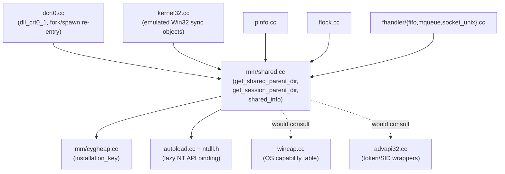

# Dependencies

**Scope**: Only dependencies relevant to the process-startup / shared-object-namespace subsystem are detailed here (per the task scope in `aidlc-state.md`); the full monorepo dependency graph (newlib/libgloss toolchain dependencies, etc.) is out of scope.

## Internal Dependencies (within winsup/cygwin)

### mm/shared.cc depends on mm/cygheap.cc
- **Type**: Compile/Runtime
- **Reason**: Reads `cygheap->installation_key` to construct the literal object-namespace path name.

### mm/shared.cc depends on autoload.cc / ntdll.h
- **Type**: Compile/Runtime
- **Reason**: Native `NtCreateDirectoryObject`/`NtOpenDirectoryObject`/`NtQueryInformationProcess` calls are lazily bound (no static ntdll import lib) through this layer.

### kernel32.cc, pinfo.cc, flock.cc, fhandler/{fifo,mqueue,socket_unix}.cc depend on mm/shared.cc
- **Type**: Runtime
- **Reason**: All obtain the cached parent-directory handle from `get_shared_parent_dir()`/`get_session_parent_dir()` and create their own named objects relative to it (`RootDirectory` in `OBJECT_ATTRIBUTES`). Confirms a fix confined to `mm/shared.cc` propagates correctly to all of them.

### dcrt0.cc depends on mm/shared.cc
- **Type**: Runtime
- **Reason**: `dll_crt0_1`, `child_info_fork::handle_fork()`, and `child_info_spawn::handle_spawn()` all call `memory_init()` (which calls into `mm/shared.cc`) on every process start, fork, and exec.

## External Dependencies

### ntdll.dll (native NT API layer)
- **Version**: OS-provided, not versioned by this project.
- **Purpose**: Direct native-layer object-manager access (`NtCreateDirectoryObject` etc.), bypassing Win32 APIs that would otherwise auto-redirect into an AppContainer's private namespace — this is precisely why the bug exists.
- **License**: N/A (OS component).

### advapi32.dll (Windows security/token APIs)
- **Version**: OS-provided.
- **Purpose**: Currently used for other security/ACL work (`advapi32.cc`); would need extension for `GetTokenInformation`-based AppContainer detection.
- **License**: N/A (OS component).

### kernelbase.dll — securityappcontainer.h (`GetAppContainerNamedObjectPath`)
- **Version**: OS-provided (documented Windows 8+ API).
- **Purpose**: Not currently linked/used anywhere in the tree; candidate dependency for the suggested fix direction.
- **License**: N/A (OS component).

### mingw-w64-cross-gcc / mingw-w64-cross-crt / mingw-w64-cross-zlib
- **Version**: Whatever the MSYS2 bootstrap environment provides at build time (see `.github/workflows/build.yaml`).
- **Purpose**: Cross-toolchain that actually compiles `msys-2.0.dll`.
- **License**: GPL/LGPL family (per respective upstream projects).
